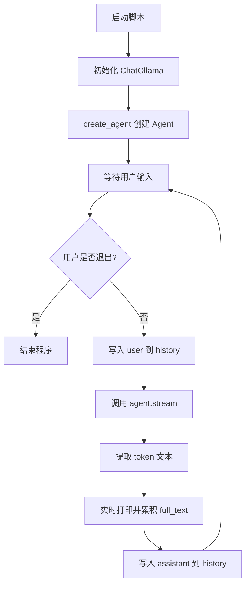

# 2026-04-05 LangChain 学习笔记

## 1. 学习的内容
- 主题：`create_agent.py` 的最小可用链路
- 文件：`/Users/zhangkailong/workspace/langchain/20260405-base/create_agent.py`
- 目标：理解“本地模型 + Agent + 流式输出 + 多轮历史”的完整执行过程

## 2. 当天的知识点框架
- Agent 入口：先初始化模型，再创建 agent。
- 对话核心：`history` 保存 user/assistant，驱动多轮上下文。
- 输出机制：`agent.stream` 逐步返回 token，实现流式体验。

## 3. 需要注意的点
- 本地服务不可用（`localhost:11434`）会直接导致失败。
- token 结构不稳定时要做兼容读取（块结构 + 纯文本）。
- 忘记把 assistant 回复写回 history，会导致下一轮失忆。

## 流程图（不贴完整代码）

## 节点职责说明
1. `初始化 ChatOllama`：连接本地模型服务，设定模型与温度。
2. `create_agent`：把模型、工具列表、系统提示词组装成可执行 Agent。
3. `等待用户输入`：接收每轮问题，支持 `quit/exit` 退出。
4. `写入 user 到 history`：把用户消息放入上下文，保证会话连续。
5. `调用 agent.stream`：触发模型生成并按流式返回结果。
6. `提取 token 文本`：从返回 token 中提取可展示文本内容。
7. `实时打印并累积 full_text`：终端边输出边拼接完整回答。
8. `写入 assistant 到 history`：保存本轮回复，供下一轮继续使用。

## 关联
- [[../index]]
- [[../02-知识框架/知识地图]]

## 下一步
- [[2026-04-06-agent-tool-calling-flow]]：在当前最小链路上加入 tools 调用与事件观察。
