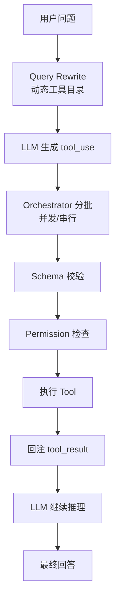

# 2026-04-06 Agent 调用 Tools 进阶笔记（Claude 对照版）

## 1. 学习的内容
- 主题：把 Claude Code 的 tool 调用思路映射到我的 Python demo。
- 当前实践文件：`/Users/zhangkailong/workspace/langchain/20260406/create_agent_with_tools.py`
- 参考源码：`/Users/zhangkailong/workspace/code/cc-localdev/src/services/tools/*`、`query.ts`、`Tool.ts`。
- 本次关键收获：提示词只保留通用行为，具体工具治理下沉到 `schema + policy + orchestration + permissions`。

## 2. 当天的知识点框架

### 2.1 Claude 的实现逻辑（抽象层）
1. **Tool 定义层**：每个工具是结构化对象，不只是函数（有 input schema、并发安全、权限规则等）。
2. **Query 主循环层**：先收集 `tool_use`，再由调度器执行，不是模型直接执行到底。
3. **Orchestration 调度层**：按工具并发安全属性分批，支持并发与串行混合。
4. **Execution 执行层**：执行前先过输入校验、权限检查，再真正调用工具。
5. **Result 回注层**：工具结果以 `tool_result` 形式回注模型，驱动下一轮推理。

### 2.2 我当前代码的对应实现
- **schema**：`_tool_input_schema_summary` / `_validate_tool_args`（从工具 schema 构建目录并做执行前校验）。
- **policy**：`ToolPolicy` + `TOOL_POLICIES`（只读、并发安全、确认需求）。
- **orchestration**：`_partition_tool_calls` + `schedule_and_run_tools`（并发批次/串行批次）。
- **permissions**：`_check_tool_permission`（最小权限闸门，默认阻止非只读）。
- **query 改写**：`rewrite_query`（基于动态 tool catalog 的通用改写，不写死工具规则）。

### 2.3 对照结论（Claude vs 当前实现）
- Claude 是完整 runtime，能力更全（别名、Hook、拒绝后重试、遥测、MCP 动态连接等）。
- 我现在是精简版骨架，但主干思想已经一致：
  - Prompt 轻（通用行为）
  - Runtime 重（工具治理）

## 3. 需要注意的点
- 不要把具体工具策略硬编码在系统提示词里，工具一多会失效。
- `query rewrite` 必须基于动态 tool catalog，否则后续扩展会断层。
- 执行前闸门顺序要稳定：`normalize -> schema validate -> permission -> invoke`。
- 并发只适合无副作用或已声明并发安全的工具，默认应保守串行。

## 流程图（Claude 思路映射到当前代码）

## 节点职责说明
1. `Query Rewrite`：提升工具路由质量，不改变用户意图。
2. `tool_use 生成`：模型声明“要调哪个工具和参数”。
3. `Orchestrator`：决定执行顺序（并发或串行）。
4. `Schema 校验`：确保参数结构符合工具输入要求。
5. `Permission 检查`：执行前安全闸门。
6. `Tool 执行`：调用真实函数并返回结果。
7. `tool_result 回注`：让模型基于真实结果生成最终回答。

## 关联
- [[2026-04-05-create-agent-minimal-flow]]
- [[../index]]
- [[../02-知识框架/知识地图]]
