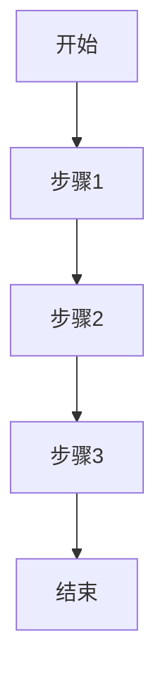

# {{date:YYYY-MM-DD}} LangChain 学习笔记

> 文件命名规范：`YYYY-MM-DD-主题.md`
> 示例：`2026-04-05-create-agent-minimal-flow.md`

## 1. 学习的内容
- 资料/章节：
- 学习目标：
- 一句话结论：

## 2. 当天的知识点框架
- 知识点 1：定义 + 作用 + 场景
- 知识点 2：定义 + 作用 + 场景
- 知识点 3：定义 + 作用 + 场景

## 3. 需要注意的点
- 容易踩坑：
- 调试重点：
- 明天验证：

## 流程图（优先，不贴完整代码）

## 节点职责说明
1. 步骤1：
2. 步骤2：
3. 步骤3：

## 关联
- [[../index]]
- [[../02-知识框架/知识地图]]
